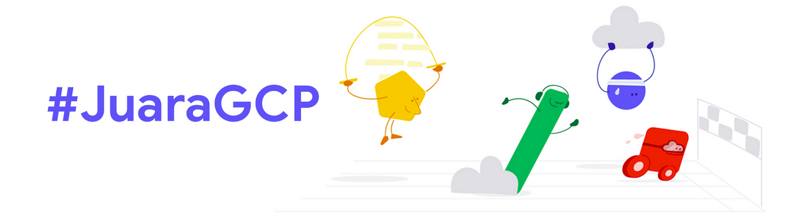

## #JuaraGCP Challenge

Theme: Cloud Computing and Serverless Technology\
Date: Jan 13, 2022 00:00 - Jan 30, 2022 23:59

Register [here](https://docs.google.com/forms/d/e/1FAIpQLSeTSIPOZVvqmU7cRapQOACd0TfzGNzVyvb__OQpSFOpL0kzeQ/viewform?usp=pp_url&entry.1487425802=ID-22-I49SL0) to get started\
Submit your qwiklabs profile [here](https://docs.google.com/forms/d/e/1FAIpQLScKlIJ7J5itzwIZU7fJx9nd9e7xKTr2vHa_1Bs8IP0fbjmucA/viewform?usp=pp_url&entry.101798730=ID-22-I49SL0) (Deadline: 30th January 2022)

Join our [Telegram](https://t.me/JuaraGCP) community\
Get one month Qwiklabs access [tutorial](https://www.youtube.com/watch?v=o0SK9UoJwq4)

**Note**: This repository contains **challenge lab** only\
Other references: [Adrianus Yoga](https://www.youtube.com/c/AdrianusYoga/videos) and [Angga Agia](https://www.youtube.com/c/anggaagia/videos) Youtube Channel

&nbsp;

### Available Quests

* [Automating Infrastructure on Google Cloud with Terraform](https://www.cloudskillsboost.google/quests/159)
* [Build and Secure Networks in Google Cloud](https://www.cloudskillsboost.google/quests/128)
* [Cloud Architecture: Design, Implement, and Manage](https://www.cloudskillsboost.google/quests/124)
* [Create and Manage Cloud Resources](https://www.cloudskillsboost.google/quests/120)
* [Deploy and Manage Apigee X](https://www.cloudskillsboost.google/quests/181)
* [Deploy and Manage Cloud Environments with Google Cloud](https://www.cloudskillsboost.google/quests/121)
* [Ensure Access & Identity in Google Cloud](https://www.cloudskillsboost.google/quests/150)
* [Implement DevOps in Google Cloud](https://www.cloudskillsboost.google/quests/141)
* [Perform Foundational Infrastructure Tasks in Google Cloud](https://www.cloudskillsboost.google/quests/118)
* [Serverless Cloud Run Development](https://www.cloudskillsboost.google/quests/152)
* [Serverless Firebase Development](https://www.cloudskillsboost.google/quests/153)
* [Set Up and Configure a Cloud Environment in Google Cloud](https://www.cloudskillsboost.google/quests/119)
* [Google Cloud Essentials](https://www.cloudskillsboost.google/quests/23)
* [Google Cloud's Operations Suite](https://www.cloudskillsboost.google/quests/35)
* [Optimizing Your Google Cloud Costs](https://www.cloudskillsboost.google/quests/97)
* [Google Cloud Run Serverless Workshop](https://www.cloudskillsboost.google/quests/98)
* [Build Apps & Websites with Firebase](https://www.cloudskillsboost.google/quests/148)
* [Understanding Your Google Cloud Costs](https://www.cloudskillsboost.google/quests/90)
* [Using the Cloud SDK Command Line](https://www.cloudskillsboost.google/quests/95)
* [Cloud Development](https://www.cloudskillsboost.google/quests/67)
* [Cloud Logging](https://www.cloudskillsboost.google/quests/81)
* [Managing Cloud Infrastructure with Terraform](https://www.cloudskillsboost.google/quests/44)
* [Google Cloud Solutions I: Scaling Your Infrastructure](https://www.cloudskillsboost.google/quests/36)
* [Network Performance and Optimization](https://www.cloudskillsboost.google/quests/46)
